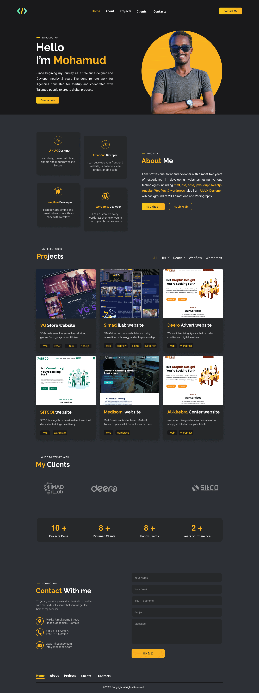

## Abuot Me

i am <b style="color:#f9af20;"> Mohamud Abshir </b>, I am a professional
Front-End developer, with almost <b>2 years </b>of experience in developing and
designing web applications, landing pages, personal sites, corporate websites,
and so on using various technologies such su <b>HTML</b>, <b>CSS</b>,
<b>JavaScript</b>, <b>React</b>, <b>Angular</b>, <b>Node js</b>, <b>SCSS</b>,
<b>Bootstrap</b>. also i develop websites using no code platforms such us
<b>webflow</b> & <b>wordpress</b> also i am a <b>UI/UX</b> designer with
background of <b>Graphic Design</b>, <b>llustrations</b>, <b>2D animations</b>
and a little bit of <b>Digital Marketing</b>

`Please dont Hesitate to contact me if you have a project i can contribute`

## Please follow Me on Mysocial

please also check my social networks with this tag <b>mhbaando</b>

- <https://www.facebook.com/mhbaando>
- <https://www.instagram.com/mhbaando>
- <https://www.linkedin.com/in/mhbaando>
- <https://www.twitter.com/mhbaando>

## CLONE AND RUN THE PROJECT

- Incase You Need to Clone or Download this project
- Make sure `node` Is installed on your computer
- Open Terminal with in the folder and type `npm install` to install all
  dependecies
- type `npm run dev` to run the application on a local host
- and dont forget to give this repo a star

## SCREENSHOT OF THE WEBSITE

